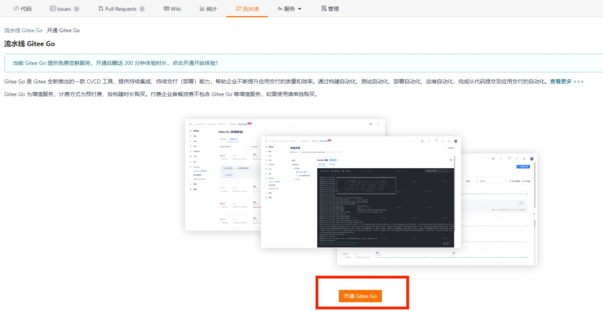
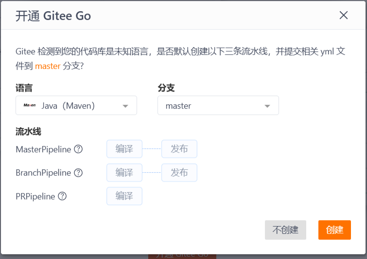
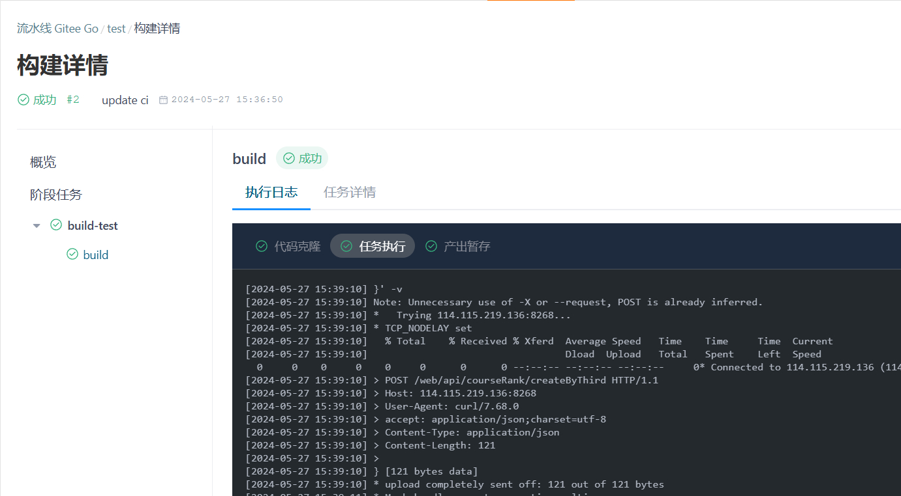

# Class-test for Gitee

**注：本仓库仅用于测试**

## 使用教程

## step0

**请确保已在训练营网站个人信息中正确填写了 Gitee Username**

### step1

fork 本仓库并开通 Gitee go 服务。

首先 fork 本仓库到自己的 Gitee 下。

而后切换到 fork 后仓库的流水线页面：



点击”开通 Gitee GO“来使用 CI。



是否创建默认流水线建议选择“不创建”。

*注：开通 Gitee go 后流水线页面显示无流水线为正常现象*

### step2

将远程仓库 clone 到本地或者使用 webIDE 进行实验

项目结构

```shell
.
├── exercises //所有习题都在此文件夹下
├── LICENSE
├── Makefile 
├── README.en.md
├── README.md
└── test //所有测例都在此文件夹下
```

本地测试

```makefile
make test-output
```

会对所有题目进行测试。

测试并保存结果

```makefile
mkdir build
make save-test-results 
```

运行此会创建 build 目录，并在 build 目录下生成 test_results.json 文件保存测试结果。

该文件格式如下：

```json
{
  "channel": "gitee",//提交渠道
  "courseId": 1558,//课程ID
  "ext": "aaa",
  "name": "xukunyuan-star",//提交者信息
  "score": 5,//提交者当前分数
  "totalScore": 5//当前实验总分
  }

```

在线的自动测试会在每次向仓库提交内容后自动运行，测试结果可以流水线页面查阅。

### step3

完成实验后，请上传至远程仓库运行 CI。详细执行情况与输出可在流水线页面查看。



最终的结果可在训练营网站查看：

[傲来操作系统社区 - 第一期傲来操作系统（EulixOS）训练营 (opencamp.cn)](https://opencamp.cn/EulixOS/camp/202401/stage/0?tab=rank)

关于 Gitee go 的介绍：

[Gitee Go 2.0 - Gitee.com](https://gitee.com/help/categories/69)

